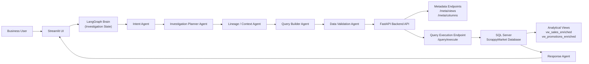

# Scrappy Market Agentic AI – System Architecture

## Overview

The Scrappy Market Agentic AI platform enables business users to investigate retail performance using natural language questions. The system uses a multi-agent architecture powered by LangGraph, a FastAPI backend that provides controlled access to the data layer, and a SQL Server database containing synthetic retail datasets and analytical views.

This architecture is designed to support explainable AI investigations while ensuring safe, structured interaction with the database.

---

# High-Level System Flow

User → Streamlit UI → LangGraph Agents → FastAPI API Layer → SQL Server → Response Agent → Streamlit UI

---

## System Architecture Diagram



---

## Frontend Layer (Streamlit UI)

The Streamlit UI serves as the **user-facing layer** of the Scrappy Market Agentic AI system. It allows business users to interact with the system using natural language questions without requiring knowledge of SQL or database structures.

### Responsibilities

The Streamlit UI is responsible for:

- Capturing natural language investigation questions from users
- Sending the user query into the agent orchestration workflow
- Displaying the SQL query generated by the system for transparency
- Displaying returned query results in tabular or visual format
- Displaying the reasoning explanation generated by the agents
- Showing a confidence score for the investigation

### Example User Interaction

User Question: Why did sales drop in the Mountain region last quarter?


The UI then displays:

- Generated SQL query
- Query results
- AI reasoning explanation
- Confidence score

This transparency is important for explainable AI investigations.

---

## Orchestration Layer (LangGraph)

The orchestration layer is implemented using **LangGraph**, which coordinates the multi-agent investigation workflow.

LangGraph maintains the **Investigation State**, which includes:

- The detected business intent
- Generated investigation hypotheses
- Supporting evidence
- Confidence score

The orchestration layer controls:

- The sequence of agent execution
- Branching logic between agents
- Looping back when investigation confidence is insufficient

This ensures the system performs **structured reasoning instead of generating SQL immediately**.

---

## Agent Roles and Responsibilities

The investigation workflow consists of multiple specialized agents.

### Intent Agent

The Intent Agent analyzes the user’s question to determine:

- The business metric involved (sales, promotions, shrink)
- Relevant dimensions (region, store, product)
- Time range
- Investigation type

Example output:
Metric: Sales
Dimension: Region
Filter: Mountain
Time Range: Last Quarter


---

### Investigation Planner Agent

The Investigation Planner Agent creates a **step-by-step investigation plan** based on the detected intent.

Example plan:

1. Compare sales performance between quarters  
2. Check promotion activity in the region  
3. Identify product-level sales changes  

This allows the system to reason before generating SQL.

---

### Lineage / Context Agent

The Lineage Agent dynamically discovers database structure using metadata APIs.

It retrieves information such as:

- Available analytical views
- Available columns
- Relationships between entities

Example metadata APIs:
GET /meta/views
GET /meta/columns


This prevents the system from relying on static schema documentation.

---

### Query Builder Agent

The Query Builder Agent converts the investigation plan into SQL.

Example generated SQL:

```sql
SELECT region,
       SUM(sales_amount) AS total_sales
FROM vw_sales_enriched
WHERE region = 'Mountain'
GROUP BY region

```
The query is then sent to the API layer for execution.
---

### Data Validation Agent
Before execution, the Data Validation Agent checks that the SQL query is valid.

Validation checks include:

SQL syntax correctness

Alignment with investigation plan

Ensuring only allowed operations are used

This step acts as the final safety check before query execution.
---

### Response Agent
The Response Agent prepares the final response returned to the UI.

The response contains:

Generated SQL query

Query results

AI reasoning explanation

Confidence score

Example reasoning: Sales declined due to reduced promotion activity and lower product demand in the Mountain region during the previous quarter.

---

## Backend API Layer (FastAPI)

The FastAPI backend acts as the controlled interface between the agents and the SQL Server database.

Agents do not connect directly to SQL Server. Instead, they interact with the data layer through APIs.

### Responsibilities
- Expose schema metadata to agents
- Validate SQL queries before execution
- Execute safe queries against SQL Server
- Return structured JSON responses

### Planned Endpoints

Metadata APIs:
- `GET /meta/views`
- `GET /meta/columns`
Query execution API:
- `POST /query/execute`

---

## Data Layer (SQL Server)

The SQL Server database stores the ScrappyMarket schema, synthetic retail datasets, and analytical views used for investigation scenarios.

### Core Tables
- Sales
- Products
- Stores
- Dates
- Promotions
- PromotionProducts
- Inventory
- Users

### Semantic Views
- `vw_sales_enriched`
- `vw_sales_daily_store`
- `vw_sales_daily_product`
- `vw_promotions_enriched`
- `vw_promo_sales_fact`
- `vw_low_stock`

The semantic views simplify SQL generation by exposing business-friendly analytical structures instead of requiring agents to reason over raw table joins.

---

## Deployment Architecture (Docker)

The project is designed to be deployed using Docker containers for portability and easier handoff.

### Application Container
Contains:
- Streamlit UI
- LangGraph orchestration and agents
- FastAPI backend

### Database Container
Contains:
- SQL Server
- ScrappyMarket schema
- synthetic seed data

The containers communicate through internal networking. Environment variables are used to configure API and database connections.

DATABASE_HOST
DATABASE_PORT
API_BASE_URL

---

## End-to-End Example Flow

1. A user enters a natural-language question in Streamlit.
2. The question is passed to the LangGraph orchestration layer.
3. The Intent Agent identifies the business question type.
4. The Planner Agent creates an investigation plan.
5. The Lineage Agent retrieves schema metadata through the API.
6. The Query Builder Agent generates SQL.
7. The Data Validation Agent validates the query.
8. The FastAPI backend executes the SQL against SQL Server.
9. Results are returned to the Response Agent.
10. Streamlit displays the SQL, results, explanation, and confidence score.

---

## Why This Architecture Supports the Project Goals

This architecture was designed to support the core goals of the Scrappy Market project:

Natural language investigation of retail data

Explainable AI reasoning workflows

Safe and structured database access

Modular multi-agent architecture

Easy deployment using Docker containers

By separating the UI, agents, API layer, and database, the system remains modular, explainable, and extensible.